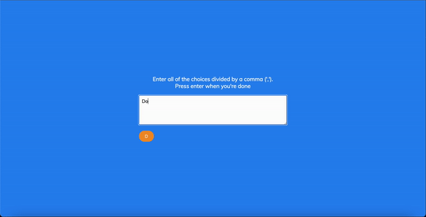

# Random_Choice_Picker
A simple web application that helps you make random choices from a list of options.

## Preview

## Features

- Allows you to enter a list of options.
- Picks a random choice from the entered options.
- Provides a clear and user-friendly interface.

## Technologies Used

- HTML
- CSS
- JavaScript

## Usage

1. Clone the repository: `git clone https://github.com/Lincoln2303/Random_Choice_Picker.git`
2. Open the `index.html` file in a web browser.
3. Enter your options in the input field, separating each option with a comma.
4. Click the "Pick Random Choice" button to get a random choice from the entered options.

## License

This project is licensed under the [MIT License](LICENSE).

## Acknowledgements

The project is part of the "50 projects in 50 days - HTML, CSS & Javascript" course on Udemy by Brad Traversy.
